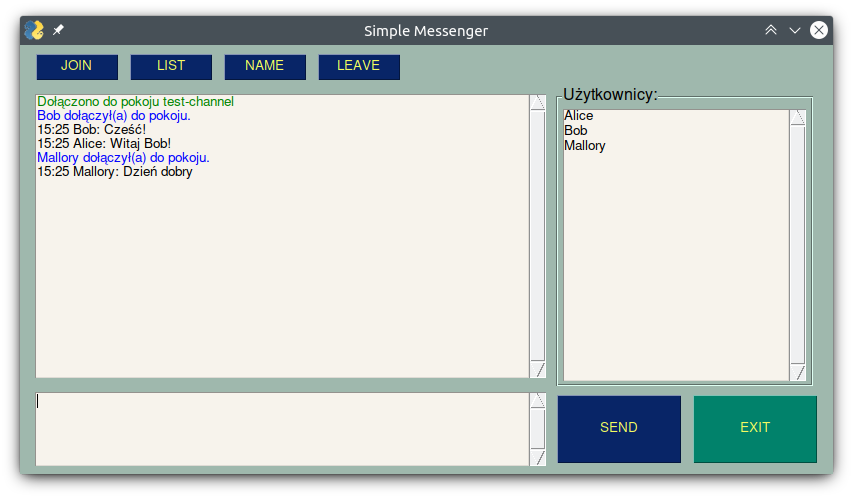

# Opis projektu

Projekt prostego czatu napisany w języku Python. Aplikacja pozwala na prowadzenie konwersacji grupowych w wielu pokojach rozmów jednocześnie (użytkownik może być tylko w jednym pokoju, ale pokoi może istnieć wiele). Serwer jest w stanie obsłużyć wielu klientów i oparty jest o implementację wielowątkową. Komunikacja między klientem i serwerem odbywa się asynchronicznie. Połączenie między klientem i serwerem jest szyfrowane. Aplikacja wspiera zarówno połączenia wykorzystujące IPv4 jak i IPv6.



## Wymagania:

### Klient

* Python 3.4
* PySimpleGui 4.43.0

### Serwer

* Python 3.8

# Dokumentacja protokołu

Części tekstowe wiadomości zakodowane są w UTF-8. W protokole wykorzystywane są gniazda TCP z warstwą szyfrowania wykorzystującą TLS w wersji 1.2. Teroretyczna maksymalna długość wiadomości wynosi 65 536 bajtów, lecz zaleca się stosowanie wiadomości o maksymalnej długości 4000 znaków.

## Nagłówek

Nagłówek ma stałą długość wynoszącą 14 bajtów.

### Format nagłówka

```
 0               1               2               3
 0 1 2 3 4 5 6 7 0 1 2 3 4 5 6 7 0 1 2 3 4 5 6 7 0 1 2 3 4 5 6 7
+-+-+-+-+-+-+-+-+-+-+-+-+-+-+-+-+-+-+-+-+-+-+-+-+-+-+-+-+-+-+-+-+
|        Protocol Version       |                               |
+-+-+-+-+-+-+-+-+-+-+-+-+-+-+-+-+                               |
|                                                               |
|                          Message Type                         |
|                                                               |
+-+-+-+-+-+-+-+-+-+-+-+-+-+-+-+-+-+-+-+-+-+-+-+-+-+-+-+-+-+-+-+-+
|           Data Size           |             Data              |
+-+-+-+-+-+-+-+-+-+-+-+-+-+-+-+-+-+-+-+-+-+-+-+-+-+-+-+-+-+-+-+-+

```

**Protocol Version: 2 bajty (16 bitów)**

Wersja protokołu - wartość liczbowa w postaci liczby całkowitej bez znaku (unsigned integer) zajmująca 2 bajty, umieszczona na jego początku. Wysyłana jest z kolejnością bitów 'big' w tablicy bitów, tzn. najstarszy bit znajduje się na początku tablicy bitów.

**Message Type: 10 bajtów (80 bitów)**

Typ wiadomości - tekstowa wartość zajmująca 10 bajtów nagłówka, znajdująca się bezpośrednio po wersji protokołu. Polecenia wymagają użycia znaków mieszczących się w tablicy znaków ASCII. Typy dopełniane są zawsze spacjami z prawej strony.

**Data Size: 2 bajty (16 bitów)**

Rozmiar wiadomości - wartość liczbowa w postaci liczby całkowitej bez znaku (unsigned integer) zajmująca 2 bajty, umieszczona w nagłówku bezpośrednio za typem wiadomości. Wysyłana jest z kolejnością bitów 'big' w tablicy bitów, tzn. najstarszy bit znajduje się na początku tablicy bitów. Teoretyczna maksymalna długość wiadomości wynosi 65 536 (2^16) bajtów. Rozmiar wiadomości dotyczy wyłącznie treści wiadomości (rozmiar nagłówka nie jest wliczany do tej wartości).

**Data: max 65 536 bajtów (2^16)**

Dane dołączone do nagłówka. Początek danych bezpośrednio po wartości określającej jej rozmiar.

## Typy wiadomości

* `MESSAGE`- zwykłe wiadomości między użytkownikami, przesyłane wewnątrz pokoi. Wiadomości tego typu odsyłane przez serwer mają następujący format: `HH:MM nickname: content`, gdzie `HH` to godziny, `MM` to minuty, `nickname` to nazwa użytkownika, który wysłał wiadomość, a `content` to treść wysłanej przez użytkownika wiadomości.
* `LIST` - wysłane do serwera przez klienta oznacza żądanie zwrócenia listy pokoi. Wysłane od serwera do klienta oznacza wiadomość z listą istniejących pokoi zawartą w treści tej wiadomości.
* `USERS` - wysłane od klienta do serwera oznacza żądanie zwrócenia listy użytkowników pokoju, w którym znajduje się użytkownik. Wysłane od serwera do klienta zawiera listę użytkowników znajdujących się w pokoju, w którym znajduje się dany użytkownik. Wiadomości tego typu mogą być wysyłane na żądanie, jak również wysyłane są przez serwer przy każdej zmianie stanu pokoju (dołączanie do pokoju / wychodzenie z pokoju / zmiana nazwy użytkownika znajdującego się w pokoju) do wszystkich użytkowników znajdujących się w pokoju rozmów.
* `JOIN` - żądanie od klienta o dołączenie do pokoju o nazwie podanej w treści wiadomości.
* `LEAVE` - żądanie od klienta o opuszczenie pokoju, w którym obecnie znajduje się klient.
* `NAME` - żądanie klienta o nadanie mu nazwy (pseudonimu) podanej w treści wiadomości.
* `QUIT` - informacja od klienta o chęci zakończenia połączenia z serwerem.
* `INFO` - wiadomości informacyjne różnego typu.
* `OK` - wiadomości potwierdzające zrealizowanie żądań.
* `ERROR` - wiadomości informujące o błędzie w realizacji żądań i ich niewykonaniu.

## Kody błędów

### OK:

Wiadomości `OK` służą potwierdzeniu wykonania zrealizowanych żądań. Poniżej przedstawiono znane kody wiadomości typu `OK`:

* `11` - zaakceptowano zmianę pseudonimu użytkownika.
* `21` - prawidłowe dołączenie do pokoju, którego nazwa przekazana jest w treści wiadomości.
* `22` - opuszczenie pokoju rozmów.

### ERROR:

Wiadomości `ERROR` służą do poinformowania klienta o wystąpieniu błędu w realizacji żądania przez serwer. Poniżej przedstawiono znane kody błędów:

* `11` - wiadomość typu `NAME` zawiera żądanie zmiany pseudonimu na taki, który już istnieje, co jest niedozwolone.
* `12` - wiadomość typu `NAME` zawiera żądanie zmiany pseudonimu na niedozwolony (dłuższy niż 32 znaki, pusty lub zawierający niedozwolone znaki).
* `21` - serwer otrzymał wiadomość typu `MESSAGE` od klienta nie będącego w pokoju rozmów.
* `22` - serwer otrzymał wiadomość typu `JOIN` od klienta, który znajduje się już w pokoju rozmów.
* `23` - serwer otrzymał nieobsługiwany typ wiadomości.
* `24` - serwer otrzymał wiadomość typu `LEAVE` lub `USERS` od klienta nie będącego w pokoju rozmów.
* `25` - serwer otrzymał wiadomość typu `JOIN` zawierającą niedozwoloną nazwę pokoju.

## Przepływ wiadomości

1. Serwer nasłuchuje na nowych klientów.
2. Klient łączy się z serwerem i połączenie jest podtrzymywane.
3. Jednocześnie serwer nasłuchuje na wiadomości od klienta, a klient na wiadomości od serwera.
4. Klient jako pierwszą wiadomość wysyła wiadomość typu `NAME` ze swoją nazwą użytkownika.
5. Jeśli nazwa użytkownika jest poprawna serwer odpowiada wiadomością typu `OK` z kodem `11`. W przeciwnym wypadku odpowiada wiadomością typu `ERROR` o określonym kodzie odpowiadającym typowi błędu.
6. Klient może wysłać wiadomość o wyświetlenie aktualnie istniejących pokoi wysyłając wiadomość typu `LIST`.
7. Serwer odpowiada wysyłając wiadomość typu `LIST` z listą pokoi.
8. Klient wysyła wiadomość typu `JOIN` z prośbą o dołączenie do pokoju.
9. Serwer dodaje klienta do istniejącego pokoju o podanej w treści wiadomości nazwie lub, jeśli pokój o takiej nazwie nie istnieje, tworzy nowy pokój o takiej nazwie i dodaje do niego klienta. Po tym wysyła wiadomość typu `OK` potwierdzającą dołączenie do klienta oraz wiadomość typu `INFO` do innych użytkowników w pokoju, informującą że do pokoju dołączył nowy użytkownik. W przypadku podania niedozwolonej nazwy pokoju, serwer odsyła wiadomość typu `ERROR` z kodem błędu `25`.
10. Klient wysyła i odbiera wiadomości typu `MESSAGE` w obrębie pokoju dopóki nie zdecyduje się z niego wyjść.
11. Klient wysyła wiadomość o opuszczeniu pokoju typu `LEAVE` lub wiadomość o chęci rozłączenia się z serwerem typu `QUIT` (`QUIT` skutkuje dodatkowo usunięciem użytkownika z listy użytkowników połączonych z serwerem). Opuszczenie pokoju zostaje potwierdzone przez serwer wiadomością typu `OK` z kodem `22`.
12. Serwer wysyła wiadomość typu `INFO` do członków w pokoju, w którym znajdował się dany użytkownik, informującą że dany użytkownik wyszedł. Jeśli pokój jest pusty, serwer usuwa go.
13. Jeśli klient wcześniej wysłał wiadomość o opuszczeniu pokoju `LEAVE`, klient wysyła wiadomość typu `QUIT`. Serwer po jej otrzymaniu kasuje użytkownika z listy użytkowników.
14. Połączenie między klientem i serwerem zostaje zakończone.

*Uwaga:*

Przy każdej zmianie stanu pokoju (zmiana nazwy użytkownika będącego członkiem pokoju, zmiana listy członków pokoju) serwer do każdego użytkownika, będącego członkiem danego pokoju, wysyła wiadomość typu `USERS`, której treść zawiera zaktualizowaną listę nowych użytkowników.
Wiadomości typu `LIST` oraz `NAME` oraz `USERS` mogą być wysyłane przez klienta w trakcie trwania rozmowy.

### Pierwsze połączenie

Przy pierwszym połączeniu użytkownik łączy się z serwerem za pomocą gniazda TCP na porcie 2900. Pierwszą wiadomością jaką klient wysyła do serwera jest wiadomość typu `NAME` zawierająca w treści nazwę użytkownika. Serwer nie obsłuży żadnej wiadomości innej niż typu `NAME`, jeśli użytkownik nie ustalił poprawnie swojego pseudonimu.

### Zmiana pseudonimu

Zmiana pseudonimu odbywa się poprzez przesłanie przez klienta wiadomości typu `NAME` z nazwą użytkownika w treści wiadomości. Dozwolone znaki to a-z, A-Z, 0-9 oraz ._- . Serwer odpowiada wiadomością `OK` z kodem `11` w przypadku powodzenia lub wiadomością `ERROR` o kodzie `11` jeśli pseudonim jest zajęty lub `12` jeśli składa się z niedozwolonych znaków lub jest zbyt długi (max. 32 znaki). Jeśli użytkownik znajduje się w pokoju rozmów, do członków tego pokoju zostaje wysłana wiadomość typu `INFO` informująca o zmianie nazwy użytkownika oraz wiadomość typu `USERS` zawierającą w treści zaktualizowaną listę użytkowników.

### Dołączenie do pokoju

Żeby dołączyć do pokoju klient wysyła wiadomość typu `JOIN` zawierającą w treści nazwę pokoju, do którego chce dołączyć. Serwer odpowiada wiadomością typu `OK` z kodem`21` w przypadku powodzenia lub `ERROR` z kodem `25` gdy nazwa pokoju składa się z niedozwolonych znaków. W przypadku próbu dołączenia do pokoju przez użytkownika, który już znajduje się w pokoju rozmów, serwer przesyła wiadomość `ERROR` z kodem `22`. W przypadku powodzenia, do członków danego pokoju zostaje wysłana wiadomość typu `INFO` informująca o dołączeniu nowego użytkownika oraz wiadomość typu `USERS` zawierającą w treści zaktualizowaną listę użytkowników.

### Opuszczanie pokoju

Żeby opuścić pokój klient wysyła wiadomość typu `LEAVE`. Serwer odpowiada wiadomością typu `OK` z kodem `22` w przypadku sukcesu realizacji żądania. Jeśli użytkownik żąda opuszczenia pokoju rozmów nie będąc członkiem żadnego pokoju rozmów, serwer odpowiada wiadomością typu `ERROR` z kodem `24`. W przypadku powodzenia, do członków danego pokoju zostaje wysłana wiadomość typu `INFO` informująca o opuszczeniu pokoju przez użytkownika oraz wiadomość typu `USERS` zawierającą w treści zaktualizowaną listę użytkowników.

### Opuszczanie serwera

Klient wysyła wiadomość typu `QUIT`. Użytkownik jest usuwany z listy pokoi i listy użytkowników. Jeśli był członkiem pokoju, do pozostałych członków tego pokoju zostaje wysłana wiadomość typu `INFO`, informująca o opuszczeniu pokoju przez użytkownika, oraz wiadomość typu `USERS` z zaktualizowaną listą użytkowników danego pokoju.


### Aktualizacja listy użytkowników

Serwer wysyła wiadomość typu `USERS` zawierającą w treści listę aktualnych członków danego pokoju rozmów, do tychże członków automatycznie za każdym razem, gdy zmieni się stan pokoju. Możliwe jest jednak także manualne wywołanie aktualizacji listy użytkowników przez klienta poprzez przesłanie przez niego wiadomości typu `USERS` do serwera. W przypadku niepowodzenia serwer odsyła wiadomość typu `ERROR` z kodem `24`.
